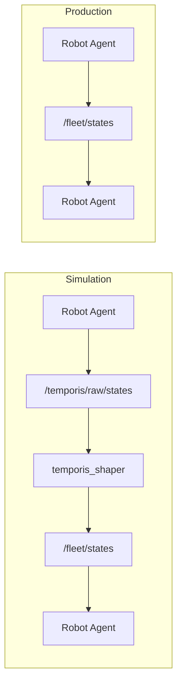
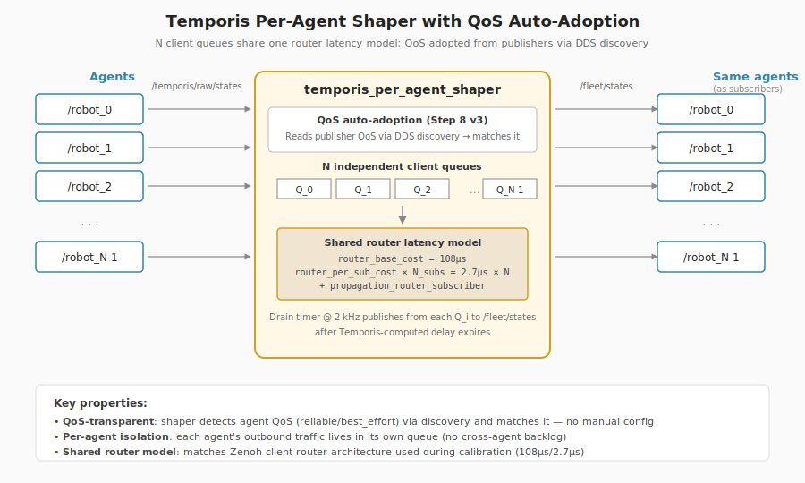
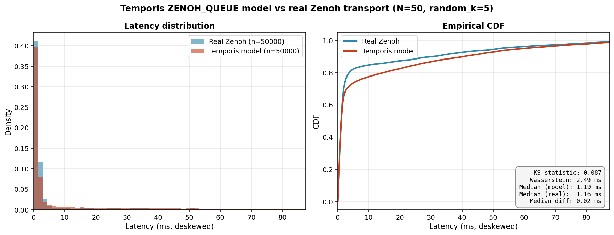
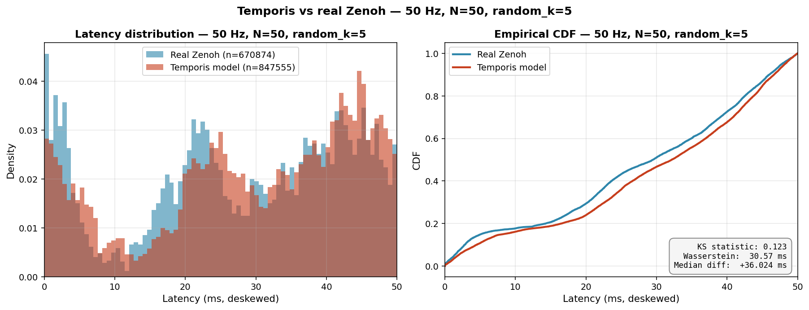
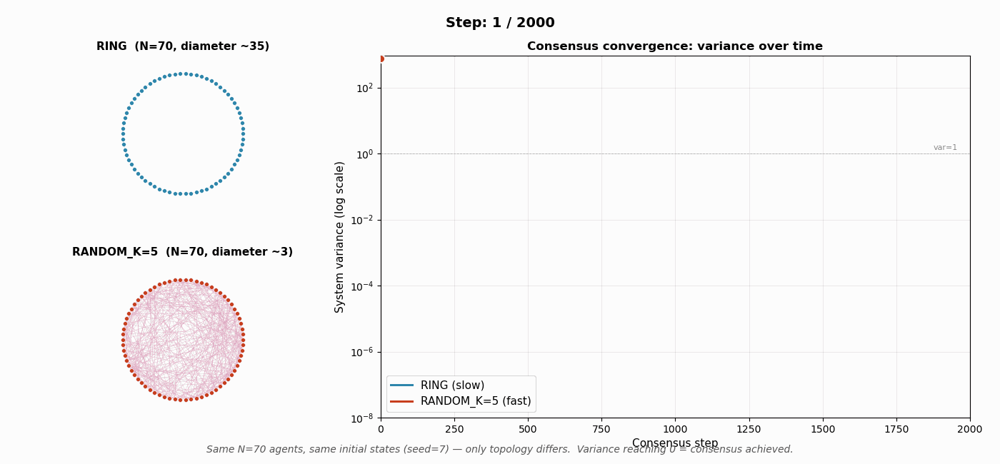

# temporis_ros2

A calibrated transport latency model for ROS2/Zenoh systems, validated
against real network behavior under two load regimes.

This is the third and final piece of a research arc that started with a
standalone queue-based latency simulator and extended through topology
experiments. This repository documents the ROS2 integration step and the
empirical validation that connects the model to a real ROS2 deployment.

```
SIM:  Agent → /temporis/raw/states → temporis_shaper → /fleet/states → Agent
PROD: Agent → /fleet/states → Agent
```

## What this is

A transport-layer latency model with:

- A calibrated stochastic queue (M/D/1) for the Zenoh client+router architecture
- A ROS2 shaper node that injects modeled latency between agents transparently
- A statistical validation methodology comparing model predictions against
  real Zenoh transport on the same workload

The shaper is a transparent middleware: agents do not change between
simulation and production. The same agent code runs against the modeled
transport (`temporis_per_agent_shaper`) or directly against Zenoh.

## What this is not

This is a research prototype focused on methodology, not a production
deployment tool. The use case is **understanding** how a ROS2 fleet
behaves under specific transport conditions, not running one.

See [Limitations](#limitations) for the honest scope.

## Motivation

Most robotic simulators model dynamics, sensors, and control, but treat
the network as either ideal or as a configurable constant. Real deployments
experience load-dependent queueing, serialization overhead, router
saturation, and stochastic jitter. These factors affect distributed
coordination algorithms in ways that flat-latency models cannot capture.

`temporis_ros2` is an attempt to take the transport model seriously:
calibrate it from a known-good benchmark, embed it into ROS2 without
agent code changes, and verify it reproduces real-system behavior to
within a documented statistical bound.

## Architecture



Internally, the shaper maintains N independent per-agent client queues
sharing one router model. This matches the Zenoh client-router-clients
architecture used during calibration:



### QoS Auto-Adoption

The shaper detects publisher QoS via DDS discovery and configures its
subscription + downstream publisher to match. This eliminates QoS
mismatch as a failure mode — the shaper works with any reliability
profile without manual configuration.

How it works:

1. In `auto` mode, the shaper does not create sub/pub at construction time
2. A 1 Hz discovery timer polls the input topic for publishers
3. On first publisher detection, the shaper reads its QoS profile
4. Sub/pub are created with matching `reliability`, `durability`,
   `deadline`, `lifespan`, `liveliness`
5. Queue depth (`qos_depth`) stays local — DDS discovery does not
   propagate history/depth

This solves a specific failure mode: at high agent counts, reliable QoS
combined with async startup causes Zenoh to buffer messages for
late-joining subscribers. Without auto-adoption, a manually-configured
reliable shaper would diverge from the agents' QoS and amplify this
backlog. With auto-adoption, the shaper joins as the same reliability
profile as the publishers and the backlog disappears.

## Calibration Methodology

The model parameters come from a Zenoh ping-pong benchmark, not from
fitted post-hoc values.

Measurement procedure:

1. Run two-process ping-pong with controlled subscriber count
2. Fit `router_base_cost` from minimum round-trip with 1 subscriber
3. Fit `router_per_sub_cost` from slope vs subscriber count
4. Fit propagation costs from client-router round-trip

Calibrated values on test hardware (Intel i7-4810MQ, rmw_zenoh_cpp 0.1.8):

| Parameter                     | Value      |
| ----------------------------- | ---------- |
| router_base_cost              | 108 µs     |
| router_per_sub_cost           | 2.7 µs     |
| propagation_client_router     | 150 µs     |
| propagation_router_subscriber | 150 µs     |
| Calibration fit error         | < 1%       |

These values are platform-specific. The methodology transfers to any
hardware/middleware combination: re-run the ping-pong, re-fit the model.

## Validation

The model was validated against real Zenoh transport on the same
workload — N=50 agents running an averaging consensus algorithm on a
random_k=5 topology. Two load regimes were tested.

### Low load — 1 Hz, ~50 msg/s total

System operates well below capacity. Single experiment, both runs
deskewed per-sender to remove inter-process clock offset.

Per-message latency distribution:



| Metric            | Value    |
| ----------------- | -------- |
| KS statistic      | 0.087    |
| Wasserstein       | 2.49 ms  |
| Median (model)    | 1.19 ms  |
| Median (real)     | 1.16 ms  |
| Median difference | 0.02 ms  |

System-level metrics also match:

| Metric                 | Model (shaper on) | Real Zenoh (passthrough) |
| ---------------------- | ----------------- | ------------------------ |
| Convergence step range | 107–111           | 104–110                  |
| Final-state drift      | 0.0025            | 0.0028                   |
| recv_count spread      | 1.20×             | 1.05×                    |

At this regime, model and real Zenoh are statistically indistinguishable.

### High load — 50 Hz, ~2500 msg/s total

System operating near saturation. Each of 50 agents publishes at 50 Hz;
each receiver handles ~2450 msg/s of inbound traffic.

Per-message latency distribution:



| Metric            | Model    | Real Zenoh |
| ----------------- | -------- | ---------- |
| Median latency    | 302 ms   | 266 ms     |
| p95               | 579 ms   | 532 ms     |
| p99.9             | 912 ms   | 915 ms     |
| Max               | 1382 ms  | 1366 ms    |
| KS statistic      | 0.123    | —          |
| Wasserstein       | 30.6 ms  | —          |
| Median difference | +36 ms   | —          |

The model is slightly more conservative than real Zenoh (~10% higher
median), which is the safer side for design decisions.

### Key observations

**1. Multimodal queueing structure.**
Both model and real show three latency peaks (~3 ms, ~22 ms, ~45 ms) at
high load. The spacing matches the publication period (20 ms at 50 Hz),
indicating messages are queueing for 0, 1, or 2 publication cycles. The
model reproduces this structure rather than smoothing it into a single
mode.

**2. Saturation behavior matches.**
Median latency grows from 1 ms (low load) to ~300 ms (high load) — a
300× increase. Both systems hit this regime at the same input rate. The
model does not predict a different saturation point than the real
transport.

**3. Real Zenoh drops, model queues.**
Real Zenoh received 670k messages; model recorded 847k (~21% more).
Under best_effort QoS, real Zenoh drops messages on buffer overflow
rather than queueing them indefinitely. The model holds queued messages
and reports their would-be arrival time. This is by design — the model
predicts what arrives if buffering were unlimited.

### Validation summary

| Regime    | KS    | Median diff   | Interpretation                          |
| --------- | ----- | ------------- | --------------------------------------- |
| Low load  | 0.087 | 0.02 ms       | Statistically indistinguishable         |
| High load | 0.123 | +36 ms / ~12% | Same structure, model ~10% conservative |

The model maintains predictive validity across two orders of magnitude
of load.

## Topology comparison (standalone)

The standalone Temporis simulator allows topology experiments that
the ROS2 integration cannot — agents in ROS2 receive all messages
regardless of topology (which only affects modeled delay, not routing).

The simulator with proper neighbor filtering shows topology effects
clearly:



At N=70 with the same initial states and seed, only changing the
topology:

| Topology   | Steps to consensus | Notes                   |
| ---------- | ------------------ | ----------------------- |
| RANDOM_K=5 | ~440               | Reaches variance < 1e-6 |
| RING       | > 36000            | Diameter ~35 hops       |
| ALL_TO_ALL | does not converge  | Saturates router        |

Topology choice creates an 80× difference in convergence cost — a
qualitative regime change, not a tuning parameter.

## Prerequisites

- ROS2 Humble or later
- C++17 compiler
- colcon
- rmw_zenoh_cpp (for Zenoh transport)

## Install

```bash
cd ~/ros2_ws/src
git clone --recurse-submodules https://github.com/Hippythalamus/temporis_ros2.git
cd ~/ros2_ws
colcon build --packages-select temporis_ros2
source install/setup.bash
```

## Quick test

```bash
# Default: shaper enabled, all parameters from config/temporis.yaml
ros2 launch temporis_ros2 consensus.launch.py

# Override topology
ros2 launch temporis_ros2 consensus.launch.py \
    num_agents:=50 topology:=random_k topology_k:=5

# Passthrough mode (real Zenoh, no shaping)
ros2 launch temporis_ros2 consensus.launch.py enabled:=false

# Custom calibration
ros2 launch temporis_ros2 consensus.launch.py \
    config_file:=/path/to/my_calibration.yaml
```

## Configuration

All tunable parameters live in `config/temporis.yaml` — single source of
truth. CLI arguments override only what's needed for one-off experiments.

Parameter groups:

| Group       | Parameters                                                        |
| ----------- | ----------------------------------------------------------------- |
| Wiring      | `input_topic`, `output_topic`, `enabled`, `model`                 |
| Topology    | `topology`, `topology_k`, `num_agents`                            |
| QoS         | `qos_reliability` (auto/reliable/best_effort), `qos_depth`        |
| Calibration | `router_base_cost`, `router_per_sub_cost`, `propagation_*`        |
| Noise       | `bandwidth_logstd`, `bandwidth_rho`, `seed`                       |
| Agent       | `alpha`, `rate_hz`, `init_seed`, `convergence_threshold`, `qos_*` |

See `config/temporis.yaml` for full documentation of each parameter.

## Runtime control

```bash
# Toggle shaper at runtime
ros2 param set /temporis_shaper enabled false
ros2 param set /temporis_shaper enabled true
```

## Agent discovery

The shaper parses agent IDs from the namespace prefix:

```
/robot_0 → agent_id 0
/robot_1 → agent_id 1
```

Configurable via `namespace_prefix` parameter (default: `"robot_"`).

## Repository structure

```
temporis_ros2/
├── launch/             # consensus.launch.py
├── config/             # temporis.yaml — single source of truth
├── src/                # shaper + consensus agent (C++17)
├── scripts/            # validation analysis + plotting
├── docs/               # diagrams, validation plots, demo
└── temporis_core/      # standalone simulator submodule
```

## Limitations

Honest scope of what's been validated:

| Condition                       | Status              |
| ------------------------------- | ------------------- |
| Localhost transport             | validated           |
| Single machine                  | validated           |
| Distributed deployment          | not tested          |
| N = 2 to 50 agents              | validated           |
| N > 50                          | not tested          |
| 1 Hz to 50 Hz publish rate      | validated           |
| Multi-machine WAN-like latency  | not tested          |
| ZENOH_QUEUE model               | validated           |
| QUEUE model                     | low-load only       |
| ring / grid / random_k topology | structure validated |
| Topology-aware ROS2 routing     | not implemented     |
| Same hardware as calibration    | valid               |
| Different hardware              | re-calibrate first  |

Specific things this prototype does not do:

- **Topology-aware routing** — in ROS2 mode, all agents receive all
  messages regardless of topology. Topology affects only the modeled
  delay (fan-out cost), not actual packet flow. For full topology
  effects, use the standalone simulator.

- **Distributed calibration** — calibration assumes a single-router
  architecture matching localhost Zenoh. Multi-router or WAN scenarios
  would require additional model components.

- **Application-layer buffer modeling** — the model is transport-layer
  only. It does not capture application-level effects like reliable QoS
  message buffering during async startup (which is why
  [QoS auto-adoption](#qos-auto-adoption) is necessary).

## Related work

This repository is the ROS2 integration step of a longer research arc:

- **Standalone simulator** (`temporis_core/`): the C++ stochastic queue
  model with topology support, used for the topology comparison results
  above.

- **Pareto-frontier analysis** (LinkedIn post #1): how queue feedback
  shapes the tradeoff between throughput and tail latency.

- **Topology comparison** (LinkedIn post #2): how graph structure
  changes convergence cost by orders of magnitude.

This repository combines all three: validated queue model + topology +
ROS2 transparent integration.

## License

Apache License Version 2.0

## Citation

If you reference this work:

```
Slepynina, E. (2026). temporis_ros2: calibrated transport latency
model for ROS2/Zenoh systems with empirical validation.
https://github.com/Hippythalamus/temporis_ros2
```