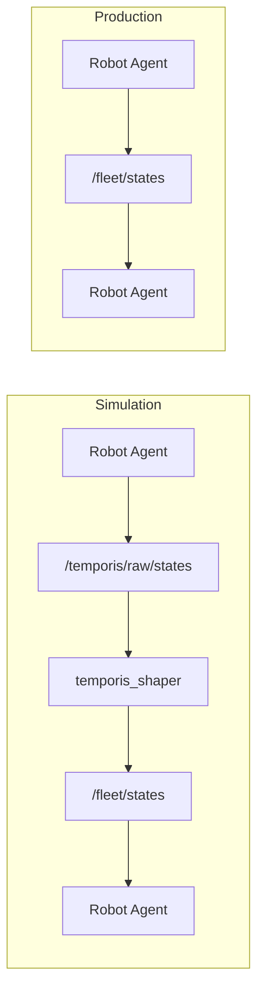

# temporis_ros2

ROS2 network latency shaper for multi-agent simulation.\
Adds realistic, load-dependent communication delays to ROS2 fleets using
Temporis latency models.

In simulation, temporis_shaper sits between agents and injects latency.\
In production, the shaper is removed --- agents communicate directly
with no code changes.

SIM: Agent → /temporis/raw/states → temporis_shaper → /fleet/states →
Agent\
PROD: Agent → /fleet/states → Agent

## Features

-   Queue-based latency modeling\
-   Zenoh client+router transport model\
-   Load-dependent delays\
-   Multi-agent topology modeling\
-   Transparent ROS2 integration\
-   Runtime enable/disable\
-   Zero changes in agent code between sim and production

## Status

Early research prototype.

Validated on: - ROS2 Humble - Serialized generic topics - QUEUE and
ZENOH_QUEUE latency models

Planned: - MessageInfo-based sender identification - Topology-aware
forwarding (currently only affects delay model) - Native Zenoh
integration - Multi-router architectures

## Prerequisites

-   ROS2 Humble or later\
-   C++17 compiler\
-   colcon

## Install


```bash
cd \~/ros2_ws/src\
git clone --recurse-submodules
https://github.com/Hippythalamus/temporis_ros2.git\
cd \~/ros2_ws\
colcon build --packages-select temporis_ros2\
source install/setup.bash
```

## Quick test

Run shaper:
```bash
ros2 run temporis_ros2 temporis_shaper --ros-args\
-p input_topic:=/temporis/raw/test\
-p output_topic:=/test_output\
-p msg_type:=std_msgs/msg/String\
-p model:=QUEUE\
-p num_agents:=5\
-p enabled:=true\
-p bandwidth:=70.0\
-p propagation_delay:=0.05\
-p packet_size:=1.0
```

Observe output: ros2 topic echo /test_output

Measure delay: ros2 topic hz /test_output

Diagnostics: ros2 topic echo /temporis/diagnostics

Publish: ros2 topic pub /temporis/raw/test std_msgs/msg/String "{data:
'hello'}" --rate 10

## Multi-agent simulation

Simulation: ros2 launch temporis_ros2 multi_agent.launch.py

Production: ros2 launch temporis_ros2 production.launch.py

## Configuration

config/temporis_shaper.yaml

model: QUEUE or ZENOH_QUEUE\
topology: all_to_all, ring, grid, random_k\
num_agents: number of agents\
enabled: enable shaper

QUEUE: bandwidth, propagation_delay, packet_size, bandwidth_logstd,
bandwidth_rho

ZENOH_QUEUE: client_bandwidth, packet_size, propagation_client_router,
propagation_router_subscriber, router_base_cost, router_per_sub_cost

## Runtime control
```bash
ros2 param set /temporis_shaper enabled false\
ros2 param set /temporis_shaper enabled true
```
## Agent discovery

/robot_0 → agent_id 0\
/robot_1 → agent_id 1

## Limitation

Topology affects only latency model, not routing.\
All messages still go through a single output topic.

## Architecture



## Repository structure

temporis_ros2/ ├── launch/ ├── config/ ├── src/ └── temporis_core/


## Validation Results

### Baseline DDS (no shaper)

Launch:

```bash
ros2 launch temporis_ros2 production.launch.py
```

## Observed latency (5 agents, local machine):

| Metric | Value     |
| ------ | --------  |
| Mean   | 0.2–0.3 ms|
| P95	 | 0.5–0.7 ms|
| Max	 | ~1.2 ms   |

## QUEUE model

Launch:

```bash
ros2 launch temporis_ros2 multi_agent.launch.py
```
Configuration:

bandwidth = 70 B/s
propagation_delay = 50 ms
packet_size = 1 B

Observed latency:

| Metric | Value    |
| ------ | -------- |
| Mean   | ~65 ms   |
| P95    | ~66 ms   |
| Max    | 67–98 ms |

Scaling test (10 agents)

| Agents | Mean latency | P95    |
| ------ | ------------ | ------ |
| 5      | ~65 ms       | ~66 ms |
| 10     | ~65 ms       | ~66 ms |

## Result:
Latency remains stable under increased fleet size in all_to_all topology.

## Demo


